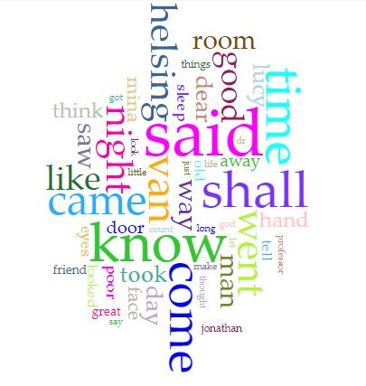
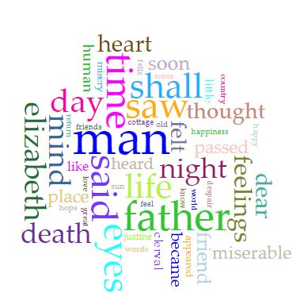
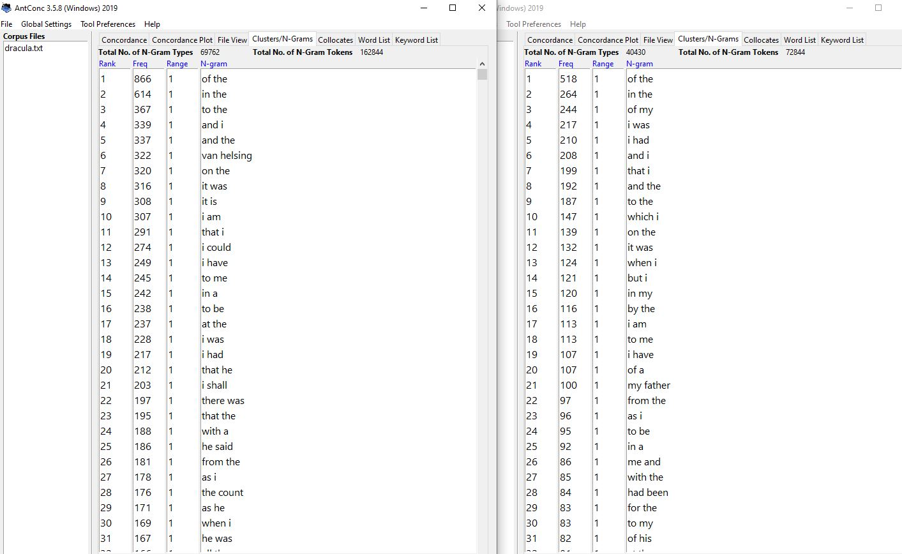
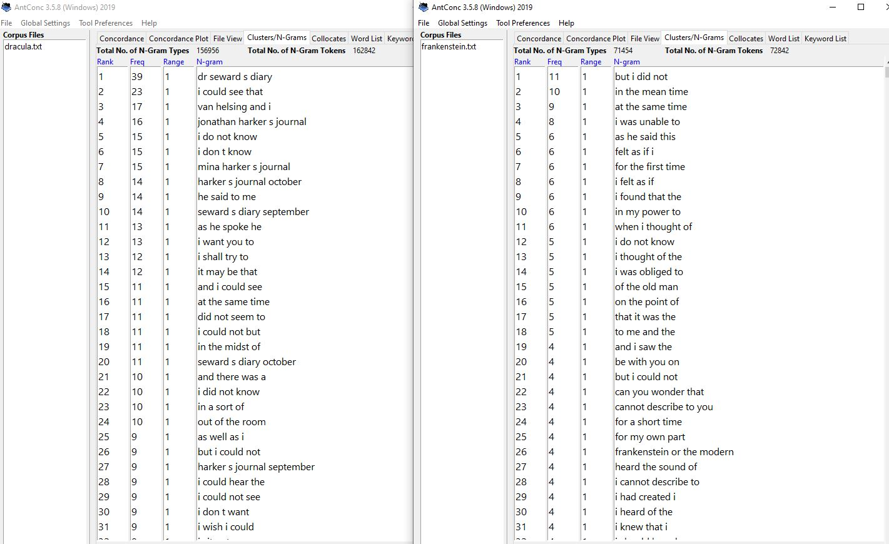
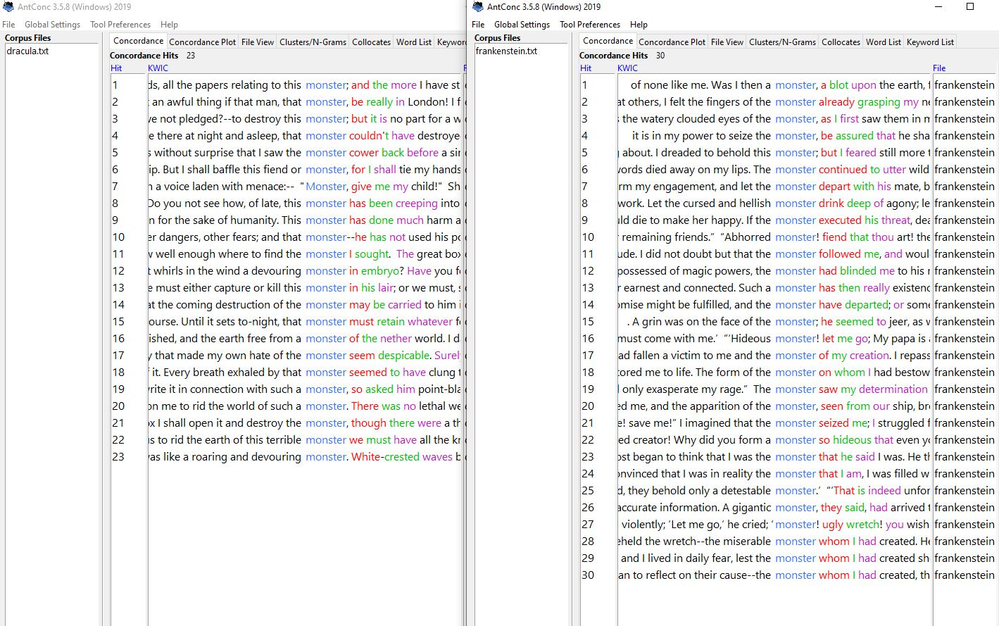

# Corpus Analysis of Frankenstein and Dracula
 
 For my Corpus analysis assignment, I compared two 19th century monster stories, Mary Shelley’s Frankenstein and Bram Stoker’s Dracula. Through comparing multiple lengths of n-grams and words in Voyant Tools and AntConc, I was able to find a few interesting similarities and differences between the two.

  
Looking at the Voyant word clouds brings some important data about what the stories mainly talked about. Seeing night in both, not as the biggest word, but as a prominent word, shows that their settings were both set mainly during the night and used as a plot point in the stories. Though one difference I see, is that Dracula is much less negative than Frankenstein. Looking at Frankenstein’s cloud, there are words of miserable, death, passed (though this could be meant as passing, not as death). These words give a much more dreary and depressing tone for the story’s topic and plot. On the other hand, Dracula has no theme like Frankenstein. Most of the main words in Dracula are either characters, verbs or descriptive words, nothing really that expresses a positive or negative connotation.

   Dracula Word Cloud
  Frankenstein Word Cloud
  

  
Looking at just 2-word long n-grams, it is prevalent that both stories are taken in a first-person perspective. Multiple n-grams that pop up hundreds of times in each story contains the word “I”, but Dracula does not seem to have many “me” or “my” words, while Frankenstein has multiple shown up in the top groups. This doesn’t really say anything about the styles of writing or plots of the story, but it is interesting to note that two stories use different ways of portraying a first-person perspective.

  
  
Moving onto a larger n-gram cluster with 4-word long n-grams. Now looking at the Dracula n-grams, there is a bit of software error that splits up the apostrophe in words, but it does reveal how the plot of the story is delivered; it’s first person perspective comes through diary and journal entries from characters in the story. Also, there is a prevalent use of “I” in the Dracula writing, but it is in almost all of the common 4-word n-grams in the Frankenstein plot. However, one thing to note is that the peak of Frankenstein n-grams is 11 with “but I did not,” while Dracula peaks at 23 with “I could see that” (if you discount the 39 “Dr Seward s diary” due to program error), meaning that Dracula uses more consistent language compared to Frankenstein’s more varied word order.

   
  
The final comparison was with the word “monster” in both novels. Due to both stories focusing on classic monsters, Dracula and Frankenstein’s Monster, this comparison shows a few things. In Frankenstein, the term monster is more focused around referring to Frankenstein’s monster, as most start with “the” which refers to the creation. Meanwhile in Dracula, it doesn’t necessarily call out Dracula for being a monster, rather more comparisons and indirectly referring to Dracula as one. There is also less monster words in Dracula than there is in Frankenstein, but in both stories, they are fairly evenly dispersed among the whole length of the novels.

    
