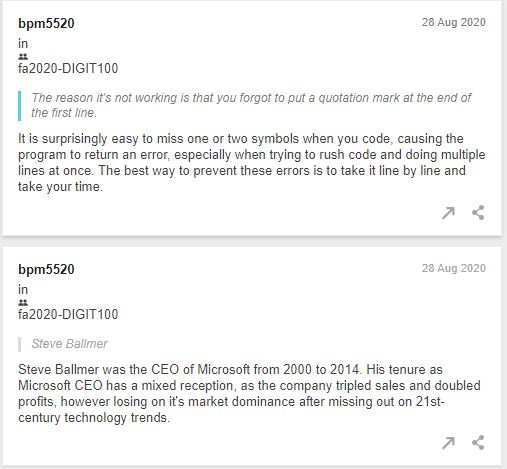
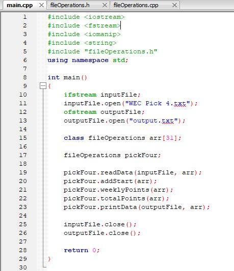

# Portfolio
### My Digital Portfolio

###### Digital Interests:
* I am a Computer Science student
* I have a limited knowledge of C++ and Java coding
  * Created C++ program to calculate Fantasy eSports Standings from a text document
  * Creating a Java program to manage an economy system in a video game
* I am a previous FIRST Robotics competitor
  * Experience on multiple FIRST Robotics teams for 7 years (FLL and FTC)
  * I was a programmer for my Robotics team in high school
    * Mapped Controls to an Xbox controller through Java for robot
    * Created autonomous robot programs for tournaments.
* Working knowledge of Microsoft Word, Powerpoint and Excel
  * Able to input data quickly and perform calculations in Excel
  * Can create graphs out of a set of data in Excel

###### Digital Projects:
* Hypothes.is
  * Earlier this semester, I used the Hypothes.is app for Google Chrome to annotate and discuss the topics in each article. This assignment asked me to read over multiple articles on different Digital Humanities topics, and provide annotations on the article, whether it be a connection I could make to the content, or defining tricky terms from the articles. It was an interesting experience, as some articles discussed the code and culture of programming, which is one of my big interests and is what I am going to Penn State to study.
  
  
* Personal Programming Projects
  * Though I have a limited knowledge on C++ code due to my single year of C++ programming courses last year, I was able to get enough knowledge to create a program that would read a notepad page containing a "fantasy-sports type" game that could be calculated into a program and return the amount of points that each user gained that week. Though this program is basic, and probably not what many would consider "professional," it is a strong start towards making more complex personal projects in the coming months and years before heading into a Computer Science career.
  

