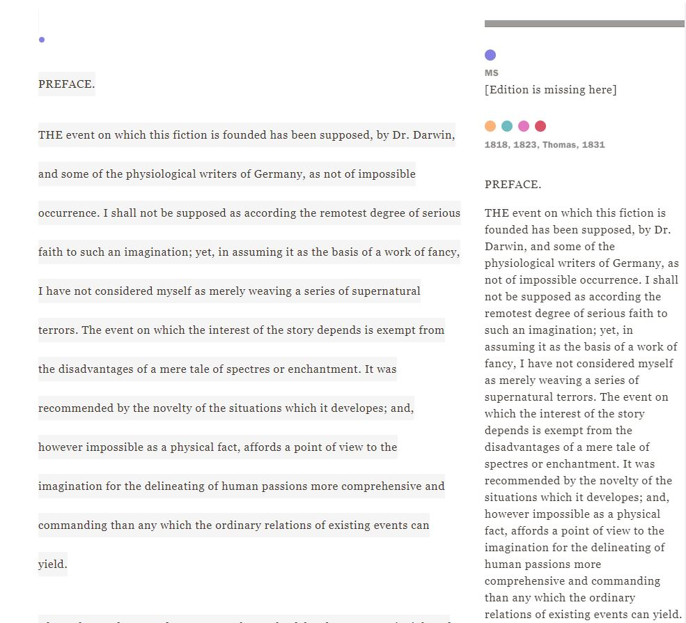
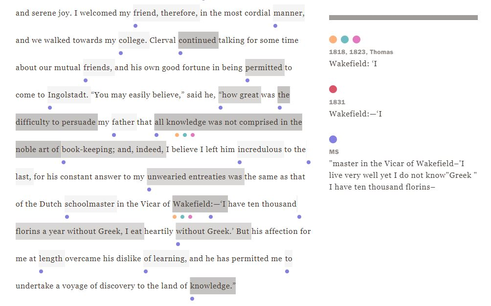
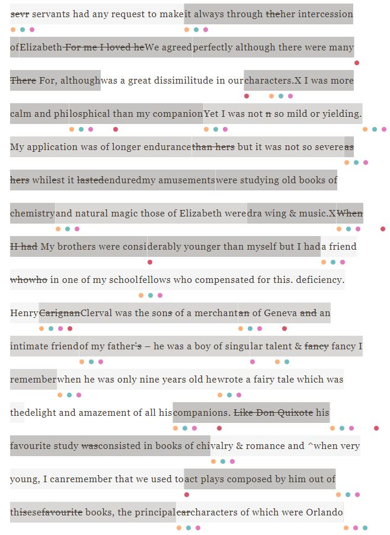

One of the most prominent differences between versions is that there are a whole 6 sections out of the 10 shown in the variorum that are missing in the 1816 (MS) version. This is most likely due to the story being made as a draft, as well as parts of the notebook that it was written in having gone missing. Looking at the four existing sections from this notebook, however, does show that the draft is much shorter and has a lot of differences in comparison to the newer versions of the story. Now this does make sense, because when writing a draft, it’s just the guidelines and the early thoughts of how the work of literature will be written. Revising, editing existing sentences, and adding more content to the story will come later when the story is taken much more seriously by Shelley when she is nearing publishing.

Another comparison of note is that of the 1831 version with the 10th section in the Variorum. It seems that most of the variations shown on this section are from the 1831 version and the original 1816 draft, and that the other versions have little variation against the 1831 version in this section. This seems to show that Shelley had this section (which would be Chapter 5 in the story) was fleshed out and mostly finalized in the earlier versions of the story. Though, looking at the few variations on Section 10 between 1831 and the other 3 versions, the 1818, 1823 and Thomas versions; these variations contain more simple variations, like a short word sequence being different or a punctuation mark being added or subtracted. Meanwhile, comparing the 1831 version to the MS 1816 version shows that the variations are more major, like in the image below, where “I live very well yet I do not know” was omitted from the 1831 version but present in the MS version.

	Looking through the Variorum was fairly straight forward. I liked the way that all the comparison and contrasting that one would need to do between versions are represented by dots, corresponding to each version, and shading, where there was a scale to show how different parts were from other forms. It made it so much easier to visualize where different versions differed in their content or way of organizing the sentence structure. Even parts that were minor, like how in Section 8 of the MS version, looking at the beginning of the chapter differences simply shows differences of how Shelley labelled the chapters or parts of her back differently between versions, but it is details like that which show that this Variorum is helpful in contrasting the versions. Though, a good feature for the variorum would be to have the ability to directly compare one version to another version on its own, so that a much better analysis could be created between respective versions.

