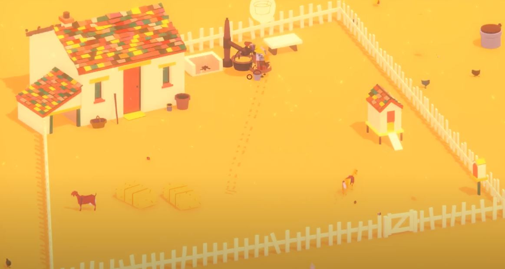
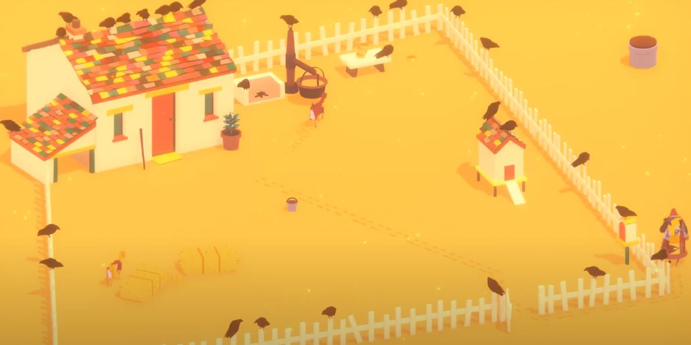

# Sand: A Superfluous Game

Sand is an open world game set in a desert landscape set in a post-apocalyptic Alaska. The game focuses around base building, keeping track of resources, participating in quests and exploring the wasteland to progress through the story and advance in the game. This game is not finished yet, but the few missions that are currently in the game are fun and engaging for the player.

### Graphics and World Building
The graphics style in Sand is 8-bit and a top down, 2D experience, reminiscient of old RPG games. This game has tons of options to build your base and world, from wood and stone walls and furniture, up to metal and advanced technologies as the game progresses. Neighboring tiles see the enemies come to life as you have to fight tooth and nail with your trusty dog companion to fend off the groups that attack you, as well as cities and buildings that speckle the wasteland. Performing missions and expanding your base add to the immersion of the world, as upgrades to your own firepower and your bases defenses help keep you protected from the enemy raids and the enemies in the open world of other tiles.

  
### NPCs and E.D.I.E.
There are multiple different NPCs in the game. Traveling salesmen will come to your sales stalls to buy and sell goods. Various people will invite you to their farms and houses to give you missions like helping to kill the Skellies around the world to free up pastures and build things for people. The main quest giver and narrative driver is the robot who crash landed into your house, E.D.I.E. E.D.I.E. gives most of the tutorial missions at the beginning, and continues to help guide the player through the story. Starting off with building walls and repairing your base, into helping you expand your base and make an advanced compound. E.D.I.E. doesn't just give you missions, he gives you a nice name, his slave... or I mean, "friend." 

### My Opinions
Sand: A Superfluous Game is an interesting indie game. The open world nature and desert wasteland lead to it feeling open and barren in some areas, especially if there are no compounds or ruins to explore in the squares. The early game can definitely feel monotonous just grinding out building and collecting supplies, but the intensity ramps up when the enemies begin to pile up and take much more strategic planning to kill. I will have to return to the game at another time to invest more energy into exploring the wasteland and expand the base that I have built even further. It is entertaining to listen to E.D.I.E. talk to you and send you out on quests to go make "his" base stronger and better so that it can attract many more "minions" for him to use. Most my 90 minutes of game time was spent exploring and searching for tasks and resources to continue moving, and to get to the first mission at the farmhouse could be daunting, especially if you are not one to risk a travel further than a tile or two away from your home. Though limited in it's graphical capabilities and amount of objects to create for your base, I can see that someone who invests more time into it than I have could make a giant complex that could have a thriving community inside of it, all led by E.D.I.E. of course. The vast wasteland holds surprises around every corner, from hordes of Skellies to large houses and ruins to quest through and explore. 

  
  
# Where The Goats Are

Where the Goat Are is a point-and-click game set on a small fenced-in farm, where you take control of a old woman working on the farm daily to do chores and interact with the various objects in the single screen of the setting. The game is much more focused on the story than the gameplay, as each day has the same cycle of milking goats, making cheese, selling to the merchant and reading new letters each day.

### Gameplay

The gameplay in Where the Goats Are is very basic, pointing and clicking around the screen to interact with the farm animals, the well, and the cheese machine in the small world. The farm is isolated, only getting a visit from the mailman/trader each day to get mail from our character's family members who have moved into the city, away from the farm life. Each day is basically the same tasks, doing the same thing over and over until the story progresses through the letters that are brought to the character. There is not much to say about the gameplay, its the same thing for days on end in-game until the ending.

### Story

The story is what is focused on most in the game. Our character, Tikvah, receives letters all of her family members that have moved to the city in search of better jobs and better lives. As Tikvah continues to run the farm, the letters start off from hopeful and excited for their new lives, to dreary and depressing as the world slowly deteriorates in the city. Meanwhile, at the farm, everyday Tikvah gets slower, doing tasks and moving around at a slower pace while the days get shorter and shorter. As the game progresses, the farm begins to slow down, and die off, characterized by the emergence of the crows cawing around the farm, as well as the loss of the chickens, then the plant, then the goats, and finally Tikvah herself. The things included in the letters as well as the way that the game allows you to go about your day the way you want shows the true meaning behind the game, play how you want in your life, since you only have so long to make it count. The open-ended nature of the gameplay, and the lack of direction for how you should go about the farm chores gives the game a peaceful mood so to get into the story and dissect the meaning behind it all.

  
### My Opinions and Comparison to Sand: A Superfluous Game
 
Where the Goats Are is a meaningful and dark game that flows through the daily tasks peacefully of the old woman Tikvah. The calming color palette gives a relaxing vibe, and the monotonous, unchallenging gameplay adds to that sense of relaxation. The main strength of the game is the beautifully woven story which reveals a deep meaning after the final day. Though, I don't have much to talk about the game. The roughly hour-long playthrough was entertaining to read the letters and think about the story, but the monotony of the gameplay made it a slog to get through, however that's just the intended reasoning behind it. The way that the player chooses how Tikvah will spend her remaining days on her farm and the way that stuff deteriorates for both her and her relatives shows the way that life can get boring and stack against you, but you can still find a way to keep yourself entertained and feel like you are doing something worth that time, no matter how small or menial of a task it is.
Comparing this to Sand: A Superfluous Game is like night and day in the elements of the two. Sand has an RPG feel, with questing, fighting, collecting, and building all keeping you entertained and enthralled in the gameplay. However, Goats is more of a relaxing game with a deeper meaning behind it, so both games would attract different audiences and players. Sand is the much better game for myself, as it kept me on track with tasks and leveling things up, while Goats just played through an interactive story that revealed it's ideas from the slow gameplay. Though, for a majority of people, Where the Goats Are would be a fantastic game to play through and just think about how the story relates to our world and our own lives as we go through our monotonous days of work, trying to find the ways to fulfill our interests and entertainment that we desperately crave in our lives.
