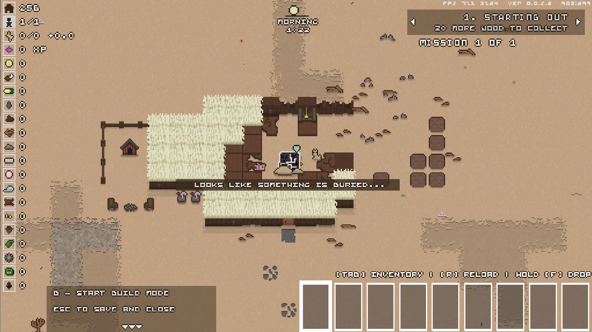
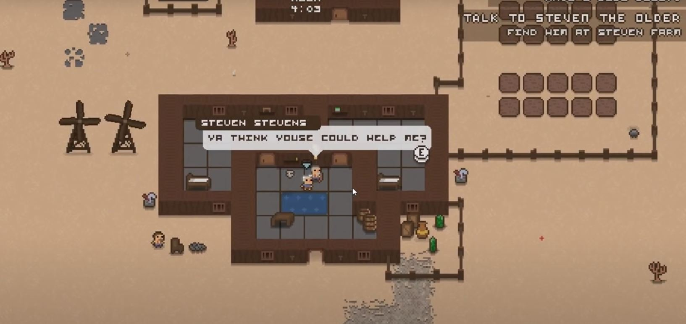

# Sand: A Superfluous Game

Sand is an open world game set in a desert landscape set in a post-apocalyptic Alaska. The game focuses around base building, keeping track of resources, participating in quests and exploring the wasteland to progress through the story and advance in the game. This game is not finished yet, but the few missions that are currently in the game are fun and engaging for the player.

### Graphics and World Building
The graphics style in Sand is 8-bit and a top down, 2D experience, reminiscient of old RPG games. This game has tons of options to build your base and world, from wood and stone walls and furniture, up to metal and advanced technologies as the game progresses. Neighboring tiles see the enemies come to life as you have to fight tooth and nail with your trusty dog companion to fend off the groups that attack you, as well as cities and buildings that speckle the wasteland. Performing missions and expanding your base add to the immersion of the world, as upgrades to your own firepower and your bases defenses help keep you protected from the enemy raids and the enemies in the open world of other tiles.

  
### NPCs and E.D.I.E.
There are multiple different NPCs in the game. Traveling salesmen will come to your sales stalls to buy and sell goods. Various people will invite you to their farms and houses to give you missions like helping to kill the Skellies around the world to free up pastures and build things for people. The main quest giver and narrative driver is the robot who crash landed into your house, E.D.I.E. E.D.I.E. gives most of the tutorial missions at the beginning, and continues to help guide the player through the story. Starting off with building walls and repairing your base, into helping you expand your base and make an advanced compound. E.D.I.E. doesn't just give you missions, he gives you a nice name, his slave... or I mean, "friend." 

### My Opinions
Sand: A Superfluous Game is an interesting indie game. The open world nature and desert wasteland lead to it feeling open and barren in some areas, especially if there are no compounds or ruins to explore in the squares. The early game can definitely feel monotonous just grinding out building and collecting supplies, but the intensity ramps up when the enemies begin to pile up and take much more strategic planning to kill. I will have to return to the game at another time to invest more energy into exploring the wasteland and expand the base that I have built even further. It is entertaining to listen to E.D.I.E. talk to you and send you out on quests to go make "his" base stronger and better so that it can attract many more "minions" for him to use. Most my 90 minutes of game time was spent exploring and searching for tasks and resources to continue moving, and to get to the first mission at the farmhouse could be daunting, especially if you are not one to risk a travel further than a tile or two away from your home. Though limited in it's graphical capabilities and amount of objects to create for your base, I can see that someone who invests more time into it than I have could make a giant complex that could have a thriving community inside of it, all led by E.D.I.E. of course. The vast wasteland holds surprises around every corner, from hordes of Skellies to large houses and ruins to quest through and explore. 
